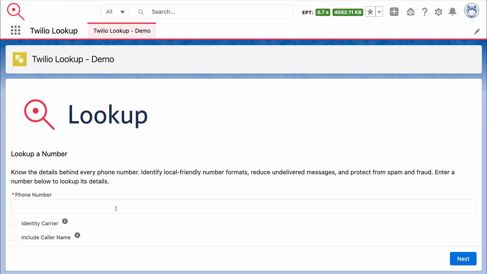

# Twilio Lookup Salesforce Demo

Now that you’ve created a Salesforce DX project, what’s next? Here are some documentation resources to get you started.

## Prerequisite

You will need the following:

- [Twilio Account](https://www.twilio.com/try-twilio)
- [Account SID and Auth Token](https://www.twilio.com/console)

## Getting Started
### Install

- Package Id: 04t5e000000hanT
- [Production](https://login.salesforce.com/packaging/installPackage.apexp?p0=04t5e000000hanT)
- [Sandbox](https://test.salesforce.com/packaging/installPackage.apexp?p0=04t5e000000hanT)

### Twilio Credentials

1. Go to Setup > Quick Find > Named Credentials.
2. Click on Twilio Lookup.
3. Click Edit.
4. In the Username text field add your Twilio Account SID.
5. In the Password text field add your Twilio Auth Token.
6. Click Save.